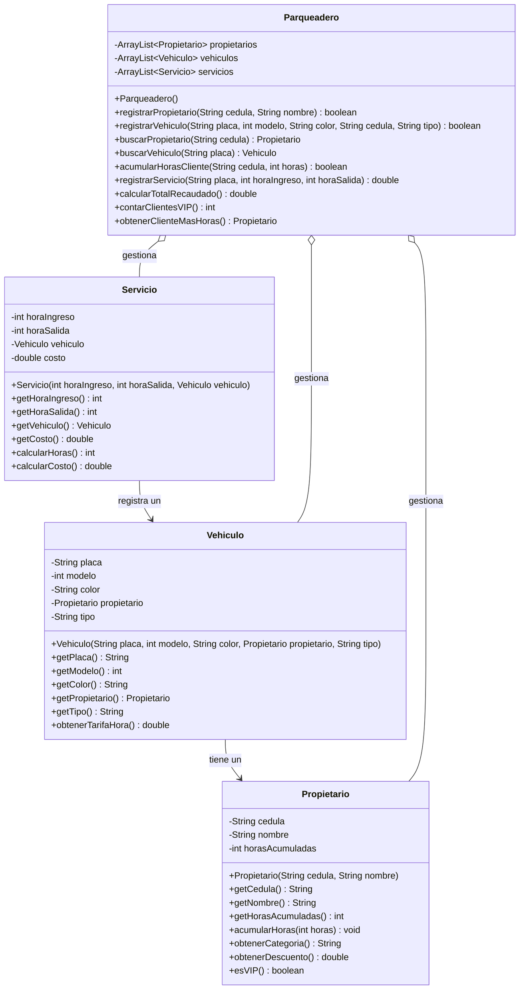

# Examen Final - Fundamentos de Programación
## Sistema de Gestión de Parqueadero "EstacionaFácil"

---

## Contexto del Problema

La empresa **"EstacionaFácil"** es un parqueadero ubicado en el centro de la ciudad que ofrece servicios de estacionamiento por horas. El negocio ha crecido y necesita un sistema de software para:

1. Registrar a los propietarios de vehículos (clientes)
2. Registrar los vehículos que usan el parqueadero
3. Cobrar por el servicio de parqueo según el tipo de vehículo
4. Premiar a los clientes frecuentes con descuentos
5. Generar estadísticas del negocio

### ¿Cómo funciona el parqueadero?

Imagina el siguiente escenario:

> **María** llega al parqueadero con su **SUV** de placas **ABC-123**. Es la primera vez que visita "EstacionaFácil", así que el empleado la registra como cliente y también registra su vehículo.
>
> María entra a las **9:00 AM** y sale a las **2:00 PM** (5 horas de parqueo).
>
> Como su vehículo es un **SUV**, la tarifa es de **$2,300 por hora**.
>
> María es cliente nueva, así que tiene **0 horas acumuladas** → categoría **ESTÁNDAR** → **0% de descuento**.
>
> **Costo:** 5 horas × $2,300 = **$11,500**
>
> Después de este servicio, María tendrá **5 horas acumuladas** en su historial.

Ahora, si María sigue usando el parqueadero y acumula más de 100 horas, pasará a ser cliente **ESPECIAL** y obtendrá un **10% de descuento** en todos sus servicios futuros.

---

## Descripción del Negocio

### 1. Los Propietarios (Clientes)

Un propietario es una persona que tiene vehículos registrados en el parqueadero.

**Datos que se guardan:**
- **Cédula**: Número único de identificación (ej: "1234567890")
- **Nombre**: Nombre completo (ej: "María García López")
- **Horas acumuladas**: Total de horas que ha usado el parqueadero (inicia en 0)

**Ejemplo de propietarios:**

| Cédula | Nombre | Horas Acumuladas | Categoría |
|--------|--------|------------------|-----------|
| 1234567890 | María García | 45 | ESTANDAR |
| 9876543210 | Juan Pérez | 250 | ESPECIAL |
| 5555555555 | Carlos López | 600 | VIP |

### 2. Los Vehículos

Cada vehículo tiene un propietario y pertenece a una de tres categorías con diferentes tarifas.

**Datos que se guardan:**
- **Placa**: Identificador único (ej: "ABC-123")
- **Modelo**: Año de fabricación (ej: 2022)
- **Color**: Color del vehículo (ej: "Rojo")
- **Propietario**: El dueño del vehículo
- **Tipo**: SEDAN, SUV o CAMION

**Ejemplo de vehículos:**

| Placa | Modelo | Color | Propietario | Tipo | Tarifa/Hora |
|-------|--------|-------|-------------|------|-------------|
| ABC-123 | 2022 | Rojo | María García | SUV | $2,300 |
| XYZ-789 | 2020 | Negro | Juan Pérez | SEDAN | $1,500 |
| CAM-456 | 2019 | Blanco | Carlos López | CAMION | $3,000 |

### 3. Los Servicios de Parqueo

Cada vez que un vehículo usa el parqueadero, se registra un servicio.

**Datos que se guardan:**
- **Hora de ingreso**: Hora en que entró (valor entre 1 y 22)
- **Hora de salida**: Hora en que salió (valor entre 2 y 23, mayor que ingreso)
- **Vehículo**: El vehículo que usó el servicio
- **Costo**: El valor cobrado por el servicio

**Ejemplo de servicios:**

| Vehículo | Ingreso | Salida | Horas | Tarifa | Descuento | Costo Final |
|----------|---------|--------|-------|--------|-----------|-------------|
| ABC-123 (SUV) | 9 | 14 | 5 | $2,300 | 0% | $11,500 |
| XYZ-789 (SEDAN) | 8 | 12 | 4 | $1,500 | 10% | $5,400 |
| CAM-456 (CAMION) | 10 | 15 | 5 | $3,000 | 15% | $12,750 |

---

## Reglas de Negocio

### Tarifas por Tipo de Vehículo

El parqueadero cobra diferente según el tamaño del vehículo:

| Tipo de Vehículo | Tarifa por Hora | Ejemplo |
|------------------|-----------------|---------|
| SEDAN | $1,500 | Mazda 3, Toyota Corolla |
| SUV | $2,300 | Toyota Fortuner, Mazda CX-5 |
| CAMION | $3,000 | Camionetas de carga, NPR |

### Sistema de Fidelización: Categorías y Descuentos

El parqueadero premia a sus clientes frecuentes con descuentos. La categoría se determina por el **total de horas que el cliente ha usado el parqueadero**:

| Horas Acumuladas | Categoría | Descuento | Descripción |
|------------------|-----------|-----------|-------------|
| 0 - 100 | ESTANDAR | 0% | Cliente nuevo o poco frecuente |
| 101 - 500 | ESPECIAL | 10% | Cliente frecuente |
| Más de 500 | VIP | 15% | Cliente muy frecuente |

**Ejemplo de evolución de un cliente:**

```
Juan empieza con 0 horas → ESTANDAR (0% descuento)
     ↓
Usa el parqueadero varias veces y acumula 101 horas → ESPECIAL (10% descuento)
     ↓
Sigue usando y acumula 501 horas → VIP (15% descuento)
```

### Cálculo del Costo de un Servicio

**Fórmula:**
```
horas = hora_salida - hora_ingreso
subtotal = horas × tarifa_vehiculo
descuento = subtotal × porcentaje_descuento
costo_final = subtotal - descuento
```

**Ejemplo Paso a Paso:**

> **Situación:** Juan (cliente ESPECIAL con 250 horas acumuladas) estaciona su SEDAN de 8:00 AM a 12:00 PM.

1. **Calcular horas:** 12 - 8 = **4 horas**
2. **Obtener tarifa:** SEDAN = **$1,500/hora**
3. **Calcular subtotal:** 4 × $1,500 = **$6,000**
4. **Obtener descuento:** Juan es ESPECIAL → **10%**
5. **Calcular descuento:** $6,000 × 0.10 = **$600**
6. **Costo final:** $6,000 - $600 = **$5,400**
7. **Actualizar horas:** Juan ahora tiene 250 + 4 = **254 horas acumuladas**

---

## Funcionalidades Requeridas

### REQUERIMIENTO 1: Registrar Cliente

**¿Qué hace?** Permite agregar un nuevo propietario al sistema.

**Regla:** No pueden existir dos propietarios con la misma cédula.

**Ejemplo:**

```
Entrada: registrarPropietario("1234567890", "María García")
         → Retorna: true (se registró exitosamente)

Entrada: registrarPropietario("1234567890", "Otra María")
         → Retorna: false (la cédula ya existe)
```

---

### REQUERIMIENTO 2: Registrar Vehículo

**¿Qué hace?** Permite agregar un nuevo vehículo asociado a un propietario existente.

**Regla:** No pueden existir dos vehículos con la misma placa.

**Ejemplo:**

```
// Primero debe existir el propietario
registrarPropietario("1234567890", "María García")

// Ahora se puede registrar su vehículo
Entrada: registrarVehiculo("ABC-123", 2022, "Rojo", "1234567890", "SUV")
         → Retorna: true (se registró exitosamente)

Entrada: registrarVehiculo("ABC-123", 2020, "Azul", "1234567890", "SEDAN")
         → Retorna: false (la placa ya existe)
```

---

### REQUERIMIENTO 3: Registrar Servicio

**¿Qué hace?** Registra un servicio de parqueo, calcula el costo con descuentos y actualiza las horas del cliente.

**Validaciones:**
- Hora de ingreso: entre 1 y 22
- Hora de salida: entre 2 y 23
- Hora de salida > Hora de ingreso
- El vehículo debe existir

**Ejemplo Exitoso:**

```
// María (ESTANDAR, 0 horas) estaciona su SUV de 9:00 a 14:00
Entrada: registrarServicio("ABC-123", 9, 14)

Cálculo interno:
  - Horas: 14 - 9 = 5
  - Tarifa SUV: $2,300
  - Subtotal: 5 × $2,300 = $11,500
  - Descuento ESTANDAR: 0%
  - Costo: $11,500 - $0 = $11,500
  - María ahora tiene: 0 + 5 = 5 horas acumuladas

→ Retorna: 11500.0
```

**Ejemplo con Descuento:**

```
// Juan (ESPECIAL, 250 horas) estaciona su SEDAN de 8:00 a 18:00
Entrada: registrarServicio("XYZ-789", 8, 18)

Cálculo interno:
  - Horas: 18 - 8 = 10
  - Tarifa SEDAN: $1,500
  - Subtotal: 10 × $1,500 = $15,000
  - Descuento ESPECIAL: 10% → $15,000 × 0.10 = $1,500
  - Costo: $15,000 - $1,500 = $13,500
  - Juan ahora tiene: 250 + 10 = 260 horas acumuladas

→ Retorna: 13500.0
```

**Ejemplos de Validaciones Fallidas:**

```
registrarServicio("ABC-123", 0, 10)   → Retorna: -1 (hora ingreso < 1)
registrarServicio("ABC-123", 23, 24)  → Retorna: -1 (hora ingreso > 22)
registrarServicio("ABC-123", 10, 1)   → Retorna: -1 (hora salida < 2)
registrarServicio("ABC-123", 10, 25)  → Retorna: -1 (hora salida > 23)
registrarServicio("ABC-123", 15, 10)  → Retorna: -1 (salida <= ingreso)
registrarServicio("ZZZ-999", 8, 12)   → Retorna: -1 (vehículo no existe)
```

---

### REQUERIMIENTO 4: Calcular Estadísticas

#### 4a) Total Recaudado

**¿Qué hace?** Suma el costo de todos los servicios registrados.

**Ejemplo:**

```
Servicios en el sistema:
  - Servicio 1: $11,500
  - Servicio 2: $5,400
  - Servicio 3: $12,750

calcularTotalRecaudado() → Retorna: 29650.0
```

#### 4b) Número de Clientes VIP

**¿Qué hace?** Cuenta cuántos propietarios tienen más de 500 horas acumuladas.

**Ejemplo:**

```
Propietarios en el sistema:
  - María García: 45 horas → ESTANDAR
  - Juan Pérez: 250 horas → ESPECIAL
  - Carlos López: 600 horas → VIP
  - Ana Martínez: 520 horas → VIP

contarClientesVIP() → Retorna: 2
```

#### 4c) Cliente con Más Horas

**¿Qué hace?** Encuentra al propietario que más ha usado el parqueadero.

**Ejemplo:**

```
Propietarios en el sistema:
  - María García: 45 horas
  - Juan Pérez: 250 horas
  - Carlos López: 600 horas  ← MAYOR
  - Ana Martínez: 520 horas

obtenerClienteMasHoras() → Retorna: Propietario("Carlos López", 600 horas)
```

---

### Estructura de Clases Requerida

Debe implementar las siguientes clases con sus respectivos métodos:



---

### Descripción Detallada de Métodos

> **Nota:** Los métodos getters y setters no se describen aquí ya que su función es simplemente retornar o modificar el valor de un atributo.

---

#### Clase `Propietario`
Cada propietario es responsable de gestionar su propia información y categoría.

##### Constructor `Propietario(String cedula, String nombre)`
Crea una nueva instancia de Propietario.
- **Parámetros:**
  - `cedula`: Número de identificación del propietario
  - `nombre`: Nombre completo del propietario
- **Comportamiento:** Inicializa los atributos cedula y nombre con los valores recibidos. El atributo `horasAcumuladas` se inicializa en **0**.

##### Método `acumularHoras(int horas)`
Incrementa las horas acumuladas del propietario.
- **Parámetro:** `horas` - Cantidad de horas a sumar
- **Retorno:** `void`
- **Comportamiento:** Suma el valor recibido al atributo `horasAcumuladas`.
- **Ejemplo:** Si el propietario tiene 50 horas y se llama `acumularHoras(10)`, quedará con 60 horas.

##### Método `obtenerCategoria()`
Determina la categoría del cliente según sus horas acumuladas.
- **Parámetros:** Ninguno
- **Retorno:** `String` - La categoría del cliente
- **Comportamiento:** Evalúa el valor de `horasAcumuladas` y retorna:
  - `"ESTANDAR"` si las horas están entre 0 y 100
  - `"ESPECIAL"` si las horas están entre 101 y 500
  - `"VIP"` si las horas son mayores a 500
- **Estructura sugerida:** Usar `if-else` o `switch` para determinar la categoría.

##### Método `obtenerDescuento()`
Calcula el porcentaje de descuento según la categoría del cliente.
- **Parámetros:** Ninguno
- **Retorno:** `double` - El porcentaje de descuento (valor decimal)
- **Comportamiento:** Según la categoría del cliente retorna:
  - `0.0` para clientes ESTANDAR (0%)
  - `0.10` para clientes ESPECIAL (10%)
  - `0.15` para clientes VIP (15%)
- **Estructura sugerida:** Usar `if-else` o `switch` basándose en la categoría o las horas.

##### Método `esVIP()`
Indica si el propietario tiene categoría VIP.
- **Parámetros:** Ninguno
- **Retorno:** `boolean`
- **Comportamiento:** Retorna `true` si `horasAcumuladas` es mayor a 500, de lo contrario retorna `false`.

---

#### Clase `Vehiculo`
Cada vehículo es responsable de conocer su tarifa según su tipo.

##### Constructor `Vehiculo(String placa, int modelo, String color, Propietario propietario, String tipo)`
Crea una nueva instancia de Vehiculo.
- **Parámetros:**
  - `placa`: Identificador único del vehículo
  - `modelo`: Año del vehículo
  - `color`: Color del vehículo
  - `propietario`: Objeto Propietario dueño del vehículo
  - `tipo`: Tipo de vehículo ("SEDAN", "SUV" o "CAMION")
- **Comportamiento:** Inicializa todos los atributos con los valores recibidos.

##### Método `obtenerTarifaHora()`
Determina la tarifa por hora de estacionamiento según el tipo de vehículo.
- **Parámetros:** Ninguno
- **Retorno:** `double` - La tarifa por hora
- **Comportamiento:** Según el tipo de vehículo retorna:
  - `1500` para SEDAN
  - `2300` para SUV
  - `3000` para CAMION
- **Estructura sugerida:** Usar `switch` sobre el atributo `tipo`.

---

#### Clase `Servicio`
Cada servicio es responsable de calcular su duración y costo.

##### Constructor `Servicio(int horaIngreso, int horaSalida, Vehiculo vehiculo)`
Crea una nueva instancia de Servicio y calcula su costo.
- **Parámetros:**
  - `horaIngreso`: Hora en que ingresó el vehículo (1-22)
  - `horaSalida`: Hora en que salió el vehículo (2-23)
  - `vehiculo`: Objeto Vehiculo que utilizó el servicio
- **Comportamiento:**
  1. Inicializa los atributos con los valores recibidos
  2. Calcula y almacena el costo del servicio llamando a `calcularCosto()`

##### Método `calcularHoras()`
Calcula la duración del servicio en horas.
- **Parámetros:** Ninguno
- **Retorno:** `int` - Número de horas de uso
- **Comportamiento:** Retorna la diferencia entre `horaSalida` y `horaIngreso`.
- **Ejemplo:** Si ingresó a las 10 y salió a las 15, retorna 5 horas.

##### Método `calcularCosto()`
Calcula el costo total del servicio aplicando tarifas y descuentos.
- **Parámetros:** Ninguno
- **Retorno:** `double` - El costo total del servicio
- **Comportamiento:**
  1. Obtener las horas de uso llamando a `calcularHoras()`
  2. Obtener la tarifa por hora del vehículo llamando a `vehiculo.obtenerTarifaHora()`
  3. Obtener el descuento del propietario llamando a `vehiculo.getPropietario().obtenerDescuento()`
  4. Calcular: `costo = horas × tarifa × (1 - descuento)`
- **Ejemplo:**
  - Vehículo SUV (tarifa $2,300), 5 horas, cliente ESPECIAL (10% descuento)
  - Subtotal: 5 × 2300 = $11,500
  - Descuento: 11,500 × 0.10 = $1,150
  - **Costo final: $10,350**

---

#### Clase `Parqueadero`
Clase principal que gestiona todas las operaciones del negocio.

##### Constructor `Parqueadero()`
Crea una nueva instancia del Parqueadero.
- **Parámetros:** Ninguno
- **Comportamiento:** Inicializa las tres listas vacías:
  - `propietarios`: Lista de objetos Propietario
  - `vehiculos`: Lista de objetos Vehiculo
  - `servicios`: Lista de objetos Servicio

##### Método `buscarPropietario(String cedula)`
Busca un propietario en el sistema por su cédula.
- **Parámetro:** `cedula` - Cédula del propietario a buscar
- **Retorno:** `Propietario` - El propietario encontrado, o `null` si no existe
- **Comportamiento:** Recorre la lista de propietarios comparando la cédula de cada uno con la cédula buscada.
- **Estructura sugerida:** Usar `foreach` para recorrer la lista.

##### Método `buscarVehiculo(String placa)`
Busca un vehículo en el sistema por su placa.
- **Parámetro:** `placa` - Placa del vehículo a buscar
- **Retorno:** `Vehiculo` - El vehículo encontrado, o `null` si no existe
- **Comportamiento:** Recorre la lista de vehículos comparando la placa de cada uno con la placa buscada.
- **Estructura sugerida:** Usar `foreach` para recorrer la lista.

##### Método `registrarPropietario(String cedula, String nombre)`
Registra un nuevo propietario en el sistema.
- **Parámetros:**
  - `cedula`: Cédula del nuevo propietario
  - `nombre`: Nombre del nuevo propietario
- **Retorno:** `boolean`
- **Comportamiento:**
  1. Verificar si ya existe un propietario con esa cédula (usar `buscarPropietario`)
  2. Si existe, retornar `false`
  3. Si no existe, crear un nuevo objeto Propietario, agregarlo a la lista y retornar `true`

##### Método `registrarVehiculo(String placa, int modelo, String color, String cedula, String tipo)`
Registra un nuevo vehículo en el sistema.
- **Parámetros:**
  - `placa`: Placa del nuevo vehículo
  - `modelo`: Año del vehículo
  - `color`: Color del vehículo
  - `cedula`: Cédula del propietario del vehículo
  - `tipo`: Tipo de vehículo ("SEDAN", "SUV" o "CAMION")
- **Retorno:** `boolean`
- **Comportamiento:**
  1. Verificar si ya existe un vehículo con esa placa (usar `buscarVehiculo`)
  2. Si existe, retornar `false`
  3. Buscar el propietario por la cédula recibida
  4. Crear un nuevo objeto Vehiculo con el propietario encontrado
  5. Agregar el vehículo a la lista y retornar `true`

##### Método `acumularHorasCliente(String cedula, int horas)`
Acumula horas de uso a un cliente específico.
- **Parámetros:**
  - `cedula`: Cédula del propietario
  - `horas`: Número de horas a acumular
- **Retorno:** `boolean`
- **Comportamiento:**
  1. Buscar el propietario por cédula (usar `buscarPropietario`)
  2. Si no existe, retornar `false`
  3. Si existe, llamar al método `acumularHoras(horas)` del propietario y retornar `true`
- **Nota:** Este método delega la responsabilidad de acumular las horas al propio objeto Propietario.

##### Método `registrarServicio(String placa, int horaIngreso, int horaSalida)`
Registra un nuevo servicio de parqueo con todas las validaciones.
- **Parámetros:**
  - `placa`: Placa del vehículo que usará el servicio
  - `horaIngreso`: Hora de entrada (1-22)
  - `horaSalida`: Hora de salida (2-23)
- **Retorno:** `double` - El costo del servicio, o `-1` si falla alguna validación
- **Comportamiento:**
  1. **Validar** que la hora de ingreso esté entre 1 y 22
  2. **Validar** que la hora de salida esté entre 2 y 23
  3. **Validar** que la hora de salida sea mayor que la hora de ingreso
  4. **Buscar** el vehículo por placa (usar `buscarVehiculo`)
  5. Si alguna validación falla o el vehículo no existe, retornar `-1`
  6. **Crear** un nuevo objeto Servicio con los datos
  7. **Obtener** la cédula del propietario del vehículo
  8. **Acumular** las horas al cliente (usar `acumularHorasCliente`)
  9. **Agregar** el servicio a la lista de servicios
  10. **Retornar** el costo del servicio
- **Estructura sugerida:** Usar múltiples `if` para las validaciones.

##### Método `calcularTotalRecaudado()`
Calcula el total de dinero recaudado por todos los servicios.
- **Parámetros:** Ninguno
- **Retorno:** `double` - La suma total de todos los costos
- **Comportamiento:**
  1. Inicializar un acumulador en 0
  2. Recorrer la lista de servicios
  3. Sumar el costo de cada servicio al acumulador
  4. Retornar el acumulador
- **Estructura sugerida:** Usar `foreach` para recorrer la lista de servicios.

##### Método `contarClientesVIP()`
Cuenta cuántos clientes tienen categoría VIP.
- **Parámetros:** Ninguno
- **Retorno:** `int` - Cantidad de clientes VIP
- **Comportamiento:**
  1. Inicializar un contador en 0
  2. Recorrer la lista de propietarios
  3. Por cada propietario, verificar si es VIP (usar método `esVIP()`)
  4. Si es VIP, incrementar el contador
  5. Retornar el contador
- **Estructura sugerida:** Usar `foreach` con `if` interno.

##### Método `obtenerClienteMasHoras()`
Encuentra el cliente con mayor cantidad de horas acumuladas.
- **Parámetros:** Ninguno
- **Retorno:** `Propietario` - El propietario con más horas, o `null` si no hay propietarios
- **Comportamiento:**
  1. Si la lista de propietarios está vacía, retornar `null`
  2. Inicializar una variable para guardar el "mayor" (puede ser el primero de la lista)
  3. Recorrer la lista de propietarios
  4. Por cada propietario, comparar sus horas con las del "mayor" actual
  5. Si tiene más horas, actualizar la variable "mayor"
  6. Al terminar, retornar el propietario con más horas
- **Estructura sugerida:** Usar `foreach` con `if` interno para comparar.

---

## Guía de Implementación por Requerimientos

Implemente los métodos organizados por cada requerimiento funcional. Después de implementar cada método, ejecute el comando de prueba indicado para verificar que funciona correctamente.

---

### REQUERIMIENTO 1: Registrar Cliente

> **Descripción:** Permite agregar un nuevo propietario al sistema. No pueden existir dos propietarios con la misma cédula.

#### Métodos a implementar (en orden):

| # | Clase | Método | Descripción | Comando de Prueba | Pts |
|---|-------|--------|-------------|-------------------|-----|
| 1 | `Propietario` | `Propietario(cedula, nombre)` | Constructor: inicializa atributos y horasAcumuladas en 0 | `mvn test -Dtest=PropietarioTest#testConstructor*` | 5 |
| 2 | `Parqueadero` | `Parqueadero()` | Constructor: inicializa las 3 listas vacías | (incluido en otros tests) | - |
| 3 | `Parqueadero` | `buscarPropietario(cedula)` | Busca en lista con `foreach`, retorna Propietario o null | `mvn test -Dtest=ParqueaderoTest#testBuscarPropietario*` | 4 |
| 4 | `Parqueadero` | `registrarPropietario(cedula, nombre)` | Valida duplicado con `if`, crea y agrega a lista | `mvn test -Dtest=ParqueaderoTest#testRegistrarPropietario*` | 5 |

**Verificación del Requerimiento 1:**
```bash
mvn test -Dtest=PropietarioTest#testConstructor*,ParqueaderoTest#testBuscarPropietario*,ParqueaderoTest#testRegistrarPropietario*
```

**Puntos del Requerimiento 1: 14 puntos**

---

### REQUERIMIENTO 2: Registrar Automóvil

> **Descripción:** Permite agregar un nuevo vehículo al sistema. No pueden existir dos vehículos con la misma placa.

#### Métodos a implementar (en orden):

| # | Clase | Método | Descripción | Comando de Prueba | Pts |
|---|-------|--------|-------------|-------------------|-----|
| 5 | `Vehiculo` | `Vehiculo(placa, modelo, color, propietario, tipo)` | Constructor: inicializa todos los atributos | `mvn test -Dtest=VehiculoTest#testConstructor*` | 5 |
| 6 | `Parqueadero` | `buscarVehiculo(placa)` | Busca en lista con `foreach`, retorna Vehiculo o null | `mvn test -Dtest=ParqueaderoTest#testBuscarVehiculo*` | 4 |
| 7 | `Parqueadero` | `registrarVehiculo(placa, modelo, color, cedula, tipo)` | Valida duplicado con `if`, busca propietario, crea y agrega | `mvn test -Dtest=ParqueaderoTest#testRegistrarVehiculo*` | 5 |

**Verificación del Requerimiento 2:**
```bash
mvn test -Dtest=VehiculoTest#testConstructor*,ParqueaderoTest#testBuscarVehiculo*,ParqueaderoTest#testRegistrarVehiculo*
```

**Puntos del Requerimiento 2: 14 puntos**

---

### REQUERIMIENTO 3: Registrar Servicio

> **Descripción:** Registra un servicio de parqueo validando horas, calculando el costo con descuentos según categoría del cliente, y actualizando las horas acumuladas.

#### Métodos a implementar (en orden):

**Paso 3.1: Lógica de categorías y descuentos del Propietario**

| # | Clase | Método | Descripción | Comando de Prueba | Pts |
|---|-------|--------|-------------|-------------------|-----|
| 8 | `Propietario` | `acumularHoras(horas)` | Suma horas al atributo horasAcumuladas | `mvn test -Dtest=PropietarioTest#testAcumularHoras*` | 5 |
| 9 | `Propietario` | `obtenerCategoria()` | Usa `if-else`: retorna "ESTANDAR", "ESPECIAL" o "VIP" | `mvn test -Dtest=PropietarioTest#testObtenerCategoria*` | 10 |
| 10 | `Propietario` | `obtenerDescuento()` | Usa `switch`: retorna 0.0, 0.10 o 0.15 | `mvn test -Dtest=PropietarioTest#testObtenerDescuento*` | 8 |

**Paso 3.2: Tarifa del Vehículo**

| # | Clase | Método | Descripción | Comando de Prueba | Pts |
|---|-------|--------|-------------|-------------------|-----|
| 11 | `Vehiculo` | `obtenerTarifaHora()` | Usa `switch`: retorna 1500, 2300 o 3000 según tipo | `mvn test -Dtest=VehiculoTest#testObtenerTarifaHora*` | 7 |

**Paso 3.3: Cálculo del Servicio**

| # | Clase | Método | Descripción | Comando de Prueba | Pts |
|---|-------|--------|-------------|-------------------|-----|
| 12 | `Servicio` | `calcularHoras()` | Retorna horaSalida - horaIngreso | `mvn test -Dtest=ServicioTest#testCalcularHoras*` | 5 |
| 13 | `Servicio` | `calcularCosto()` | Fórmula: horas × tarifa × (1 - descuento) | `mvn test -Dtest=ServicioTest#testCalcularCosto*` | 10 |
| 14 | `Servicio` | `Servicio(horaIngreso, horaSalida, vehiculo)` | Constructor: inicializa atributos y llama calcularCosto() | `mvn test -Dtest=ServicioTest` | 5 |

**Paso 3.4: Orquestación en Parqueadero**

| # | Clase | Método | Descripción | Comando de Prueba | Pts |
|---|-------|--------|-------------|-------------------|-----|
| 15 | `Parqueadero` | `acumularHorasCliente(cedula, horas)` | Busca propietario y delega acumularHoras() | `mvn test -Dtest=ParqueaderoTest#testAcumularHorasCliente*` | 5 |
| 16 | `Parqueadero` | `registrarServicio(placa, horaIngreso, horaSalida)` | Múltiples `if` para validar, crea Servicio, acumula horas | `mvn test -Dtest=ParqueaderoTest#testRegistrarServicio*` | 12 |

**Verificación del Requerimiento 3:**
```bash
mvn test -Dtest=PropietarioTest#testAcumularHoras*,PropietarioTest#testObtenerCategoria*,PropietarioTest#testObtenerDescuento*,VehiculoTest#testObtenerTarifaHora*,ServicioTest,ParqueaderoTest#testAcumularHorasCliente*,ParqueaderoTest#testRegistrarServicio*
```

**Puntos del Requerimiento 3: 67 puntos**

---

### REQUERIMIENTO 4: Calcular Estadísticas

> **Descripción:** Calcular el total recaudado, contar clientes VIP y encontrar el cliente con más horas.

#### Métodos a implementar (en orden):

**4a) Total Recaudado**

| # | Clase | Método | Descripción | Comando de Prueba | Pts |
|---|-------|--------|-------------|-------------------|-----|
| 17 | `Parqueadero` | `calcularTotalRecaudado()` | `foreach` con acumulador sobre servicios | `mvn test -Dtest=ParqueaderoTest#testCalcularTotalRecaudado*` | 8 |

**4b) Número de Clientes VIP**

| # | Clase | Método | Descripción | Comando de Prueba | Pts |
|---|-------|--------|-------------|-------------------|-----|
| 18 | `Propietario` | `esVIP()` | Retorna true si horasAcumuladas > 500 | `mvn test -Dtest=PropietarioTest#testEsVIP*` | 5 |
| 19 | `Parqueadero` | `contarClientesVIP()` | `foreach` con contador y `if` interno | `mvn test -Dtest=ParqueaderoTest#testContarClientesVIP*` | 7 |

**4c) Cliente con Más Horas**

| # | Clase | Método | Descripción | Comando de Prueba | Pts |
|---|-------|--------|-------------|-------------------|-----|
| 20 | `Parqueadero` | `obtenerClienteMasHoras()` | `foreach` buscando máximo con `if` | `mvn test -Dtest=ParqueaderoTest#testObtenerClienteMasHoras*` | 10 |

**Verificación del Requerimiento 4:**
```bash
mvn test -Dtest=PropietarioTest#testEsVIP*,ParqueaderoTest#testCalcularTotalRecaudado*,ParqueaderoTest#testContarClientesVIP*,ParqueaderoTest#testObtenerClienteMasHoras*
```

**Puntos del Requerimiento 4: 30 puntos**

---

### Resumen de Puntos por Requerimiento

| Requerimiento | Descripción | Puntos | Porcentaje |
|---------------|-------------|--------|------------|
| Compilación | El proyecto compila correctamente | 5 | 4% |
| REQ 1 | Registrar Cliente | 14 | 10% |
| REQ 2 | Registrar Automóvil | 14 | 10% |
| REQ 3 | Registrar Servicio | 67 | 48% |
| REQ 4 | Calcular Estadísticas | 30 | 21% |
| Integración | Todos los tests pasan | 10 | 7% |
| **TOTAL** | | **140** | **100%** |

---

### Verificación Final

```bash
# Ejecutar TODOS los tests
mvn clean test
```

---

## Sistema de Puntuación Automática (Autograding)

La calificación se realiza automáticamente mediante GitHub Classroom. Cada test tiene un peso según su complejidad:

### Detalle de Puntuación por Test

| # | Método | Estructura Evaluada | Complejidad | Puntos |
|---|--------|---------------------|-------------|--------|
| - | Compilación del proyecto | - | Básica | 5 |
| 1 | `Propietario(cedula, nombre)` | Constructor | Básica | 5 |
| 3 | `buscarPropietario(cedula)` | `foreach` + búsqueda | Media | 4 |
| 4 | `registrarPropietario(cedula, nombre)` | `if` + validación | Media | 5 |
| 5 | `Vehiculo(placa, modelo, color, propietario, tipo)` | Constructor | Básica | 5 |
| 6 | `buscarVehiculo(placa)` | `foreach` + búsqueda | Media | 4 |
| 7 | `registrarVehiculo(...)` | `if` + validación | Media | 5 |
| 8 | `acumularHoras(horas)` | Método simple | Básica | 5 |
| 9 | `obtenerCategoria()` | `if-else` múltiple | Media | 10 |
| 10 | `obtenerDescuento()` | `switch` | Media | 8 |
| 11 | `obtenerTarifaHora()` | `switch` | Media | 7 |
| 12 | `calcularHoras()` | Aritmética | Básica | 5 |
| 13 | `calcularCosto()` | Fórmula + llamadas | Alta | 10 |
| 14 | `Servicio(horaIngreso, horaSalida, vehiculo)` | Constructor + cálculo | Media | 5 |
| 15 | `acumularHorasCliente(cedula, horas)` | Delegación | Media | 5 |
| 16 | `registrarServicio(placa, horaIngreso, horaSalida)` | `if` múltiples + lógica | Alta | 12 |
| 17 | `calcularTotalRecaudado()` | `foreach` + acumulador | Media | 8 |
| 18 | `esVIP()` | `if` simple | Básica | 5 |
| 19 | `contarClientesVIP()` | `foreach` + contador + `if` | Media | 7 |
| 20 | `obtenerClienteMasHoras()` | `foreach` + máximo | Alta | 10 |
| - | Todos los tests pasan | Verificación final | - | 10 |

### Cálculo de la Nota Final

La nota se calcula automáticamente:

```
Nota = (Puntos Obtenidos / 140) × 5.0
```

**Ejemplo:**
- Si obtiene 112 puntos: `(112/140) × 5.0 = 4.0`
- Si obtiene 140 puntos: `(140/140) × 5.0 = 5.0`

---

## Comandos Útiles

```bash
# Compilar el proyecto
mvn clean compile

# Ejecutar todos los tests
mvn test

# Ejecutar tests de una clase específica
mvn test -Dtest=PropietarioTest

# Ejecutar un test específico
mvn test -Dtest=PropietarioTest#testObtenerCategoriaVIP*

# Ver reporte de tests (después de ejecutar)
# Abrir: target/surefire-reports/
```

---

### Notas Importantes

1. Todas las clases deben tener sus atributos **privados** y sus respectivos métodos de acceso.
2. Cada clase debe tener al menos un **constructor** que inicialice sus atributos.
3. La clase `Parqueadero` es la clase principal que contiene las listas y los métodos de las funcionalidades.
4. Utilice el tipo de dato apropiado para cada atributo.
5. Los tipos de vehículo deben manejarse de manera que solo se permitan los tres valores especificados.
6. **Implemente en orden:** Siga las fases indicadas para evitar errores de dependencia.
7. **Pruebe frecuentemente:** Ejecute los tests después de cada método implementado.

---

**¡Éxitos en su examen!**
